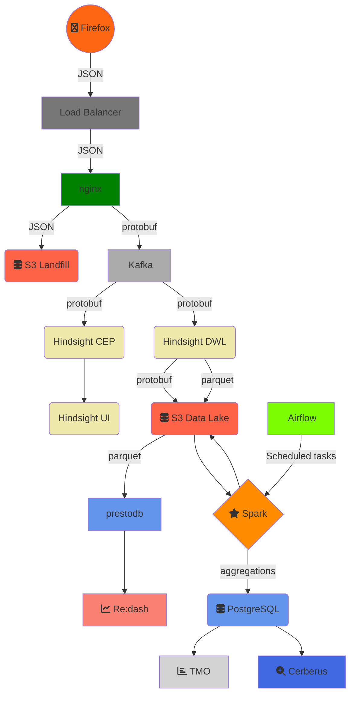
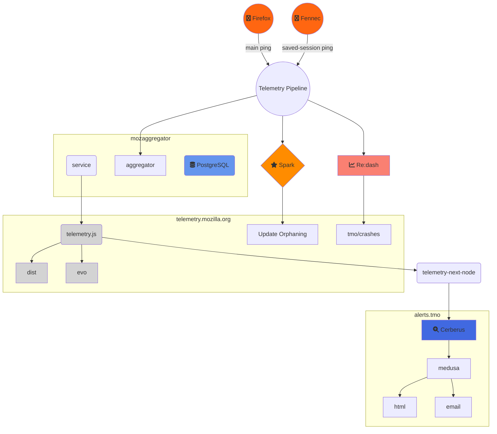

# An overview of Mozilla’s Data Pipeline

This post describes the architecture of Mozilla’s data pipeline, which is used to collect Telemetry data from our users and logs from various services. One of the cool perks of working at Mozilla is that most of what we do is out in the open and because of that I can do more than just show you some diagram with arrows of our architecture; I can point you to the code, script & configuration that underlies it!

To make the examples concrete, the following description is centered around the collection of Telemetry data. The same tool-chain is used to collect, store and analyze data coming from disparate sources though, such as service logs.

A *session* begins when Firefox starts up and ends when it shuts down. As a session could be long-running and last weeks, it gets sliced into smaller logical units called [subsessions]. Each subsession generates a batch of data containing the current state of all probes collected so far, i.e. a [main ping], which is sent to our servers. The main ping is just one of the many [ping types] we support. Developers can [create their own ping types] if needed.

*Pings* are submitted via an [API] that performs a HTTP POST request to our edge servers. If a ping fails to successfully [submit] (e.g. because of missing internet connection), Firefox will store the ping on disk and retry to send it until the maximum ping age is exceeded.

# Spark

Once the data reaches our data lake on S3 it can be processed with Spark. We provide a portal ([ATMO]) that allows Mozilla employees to create their own Spark cluster pre-loaded with a set of libraries & tools, like Jupyter, NumPy, SciPy, Pandas etc., and [an API] to conveniently read data stored in Protobuf form on S3 in a Spark RDD using a ORM-like interface. Behind the scenes we use [EMR] to create Spark clusters, which are then monitored by ATMO.

# 

A dedicated Spark job feeds daily aggregates to a PostgreSQL database which powers a [HTTP service] to easily retrieve faceted roll-ups. The service is mainly used by [TMO], a dashboard that visualizes distributions and time-series, and [Cerberus](https://github.com/mozilla/cerberus/), an anomaly detection tool that detects and alerts developers of changes in the distributions. Originally the sole purpose of the Telemetry pipeline was to feed data into this dashboard but in time its scope and flexibility grew to support more general use-cases.
