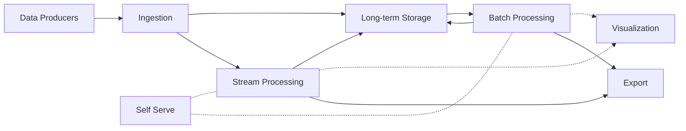
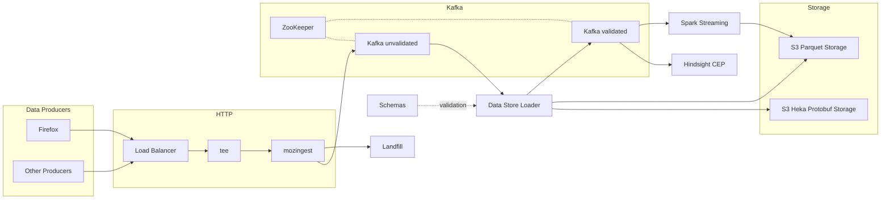
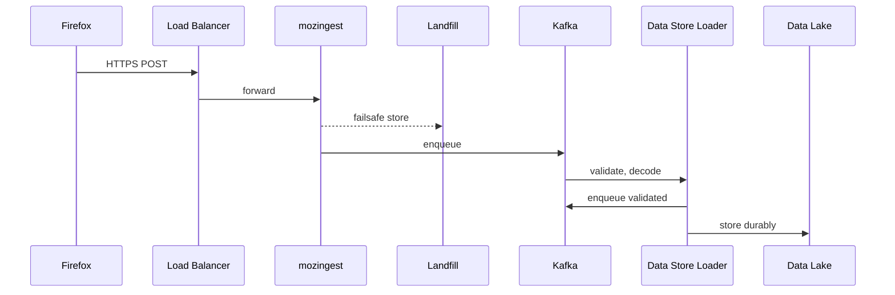
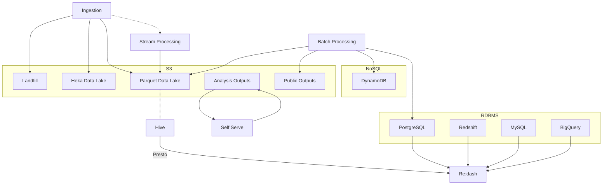
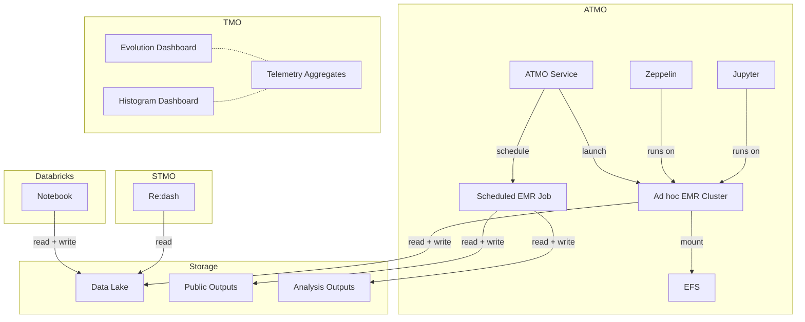
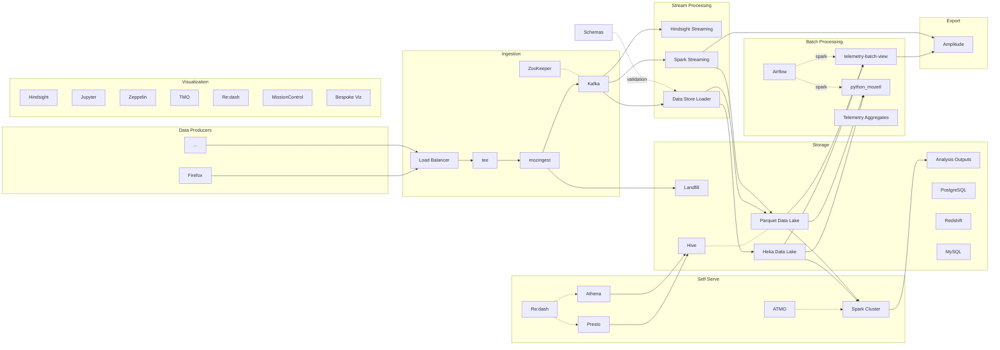

## The Entire Platform

The full detail of the platform can get quite complex, but at a high level the structure is fairly simple.

Each of these high-level parts of the platform are described in more detail below.

## Ingestion

##### Data flow for valid submissions

Hindsight is used for [ingestion of logs][hslog] from applications and services, it supports parsing of log lines and appending similar metadata as the HTTP ingestion above (timestamp, source, and so on).

Job scheduling and dependency management is done using [Airflow]. Most jobs run once a day, processing data from "yesterday" on each run. A typical job launches a cluster, which fetches the specified ETL code as part of its bootstrap on startup, runs the ETL code, then shuts down upon completion. If something goes wrong, a job may time out or fail, and in this case it is retried automatically.

Most of the data analysis tooling has been developed with the goal of being "self-serve". This means that people should be able to access and analyze data on their own, without involving data engineers or operations. Thus can data access scale beyond a small set of people with specialized knowledge of the entire pipeline.

## Bringing it all together

Finally, here is a more detailed view of the entire platform. Some connections are omitted for clarity.

