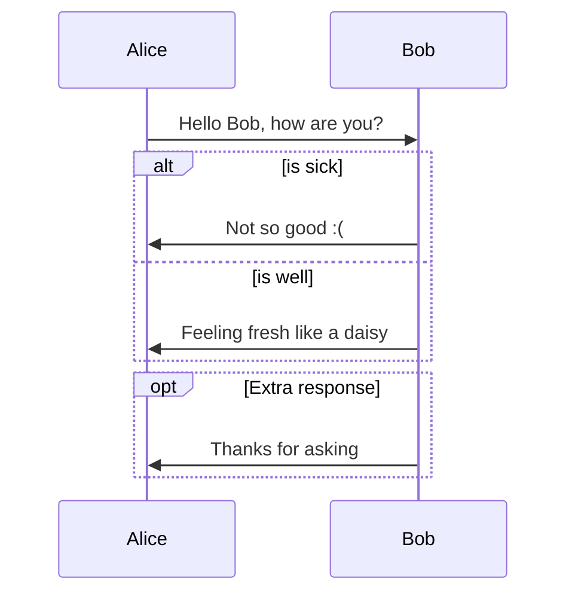

My test markdown code
---------------------

Testing MathJax equation format 1

$$
\eta = \sum r
$$

Testing MathJax equation format 2

\\[
\zeta = \sum f
\\]

Testing MathJax inline equation $ \beta \in [a_1..a_n] $ format 1

Testing MathJax inline equation \\(  \gamma \in [b_1..b_n] \\) format 2

